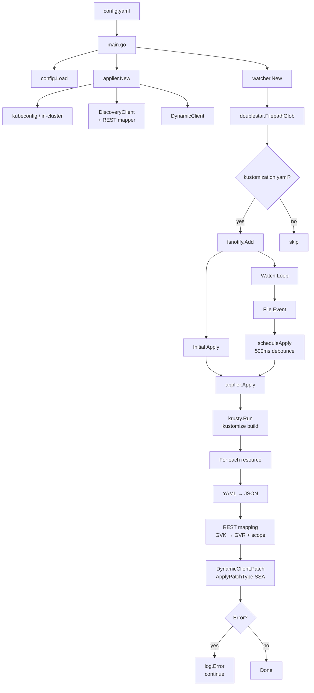
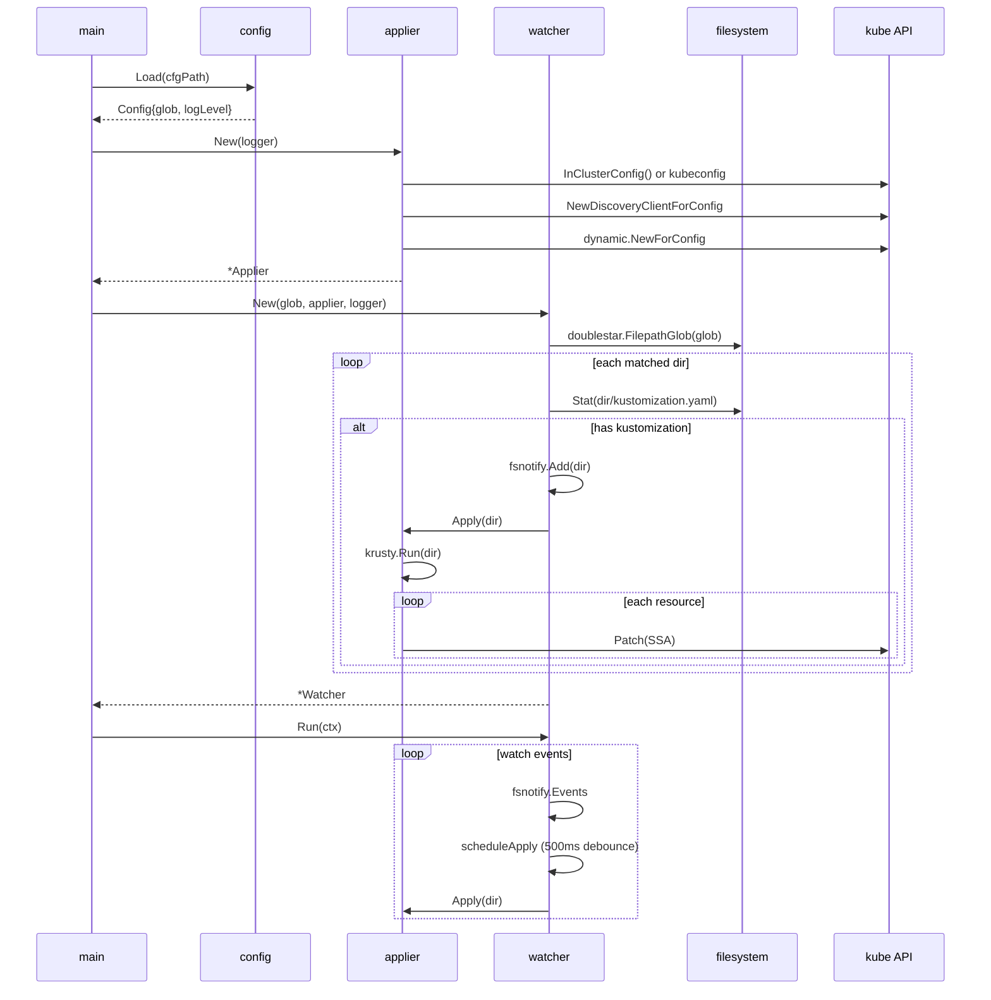

# Architecture

## Component overview



## Startup sequence



## Apply pipeline

Each `Apply` call goes through these steps:

1. **krusty build** — `krusty.MakeKustomizer(opts).Run(filesys.MakeFsOnDisk(), dirPath)` returns a `resmap.ResMap` with all rendered resources. Patches, generators, and transformers from the kustomization are applied by krusty before any resource reaches the cluster.

2. **YAML → JSON** — `res.AsYAML()` gives per-resource YAML; `utilyaml.ToJSON()` converts it to JSON. The Kubernetes SSA endpoint accepts JSON despite the patch type name containing "yaml".

3. **REST mapping** — `mapper.RESTMapping(gvk.GroupKind(), gvk.Version)` resolves the Group/Version/Kind to a REST endpoint path and scope (namespace-scoped vs cluster-scoped). The mapper caches discovery results in memory.

4. **Server-side apply** — `DynamicClient.Patch(ApplyPatchType)` with `FieldManager: "kustomize-watcher"` and `Force: true`. SSA lets the API server merge field ownership, making repeated applies idempotent and safe with other field managers (e.g. Helm or another controller).

5. **Error isolation** — each resource's apply is independent. A failure on one resource is logged and skipped; the loop continues with the remaining resources. `Apply` itself never panics.

## Debounce

File systems can emit many events for a single logical change (editors write a temp file, rename it, then update mtime). The watcher debounces per-directory:

```
event arrives → stop existing timer for dir → start new 500ms timer
                                                      ↓ (if quiet for 500ms)
                                               apply fires in a goroutine
```

Implemented with `sync.Mutex` + `map[string]*time.Timer` + `time.AfterFunc`. Since SSA is idempotent, two concurrent applies for the same directory are safe — the later one simply re-confirms the desired state.

## REST config resolution

`buildRestConfig()` tries `rest.InClusterConfig()` first (reads the service-account token and CA from the pod's mounted secrets). If that fails (i.e. not running inside a pod), it falls back to `clientcmd.NewDefaultClientConfigLoadingRules()`, which honours `KUBECONFIG` and `~/.kube/config`.

## Why no shell exec

| Operation | Shell approach | This tool |
|-----------|---------------|-----------|
| Kustomize build | `kustomize build dir \| ...` | `krusty.Run()` Go API |
| Apply to cluster | `kubectl apply -f -` | `dynamic.Patch(ApplyPatchType)` |

Avoiding shell exec eliminates: process spawn overhead, shell injection risk, dependency on binaries in `PATH`, and output parsing fragility.
